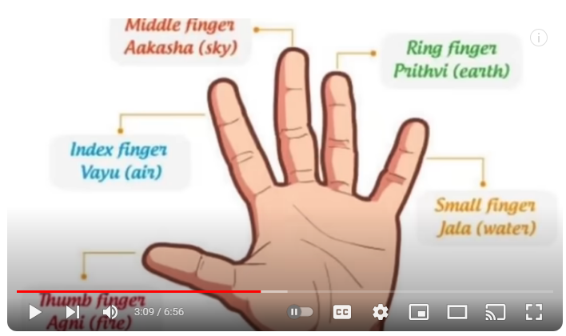

# Yoga
### Benefits of mudarai/Yoga (morning or Evening):
* doing these yoga's we will get rid of all health issues/problems
* doing these all mudarai should put mat down then sit on that and practice

### Linga mudarai: 

  * [others Click Here](https://www.youtube.com/watch?v=DQaBs-TMxyk)
  
    *  we can get rid of motion, kafa, urine, menses, asthama, sines and vushnam, it will make hot to our body
    * it will solve girls period problem too

### Chin Mudarai:

  * [others Click Here](https://www.youtube.com/watch?v=Z27ycGPAmvc)

    * if we do morning then east kelaku 
    * if we do evening then meraku 
 
    *  with this taking air inside and living air outside at early morning
    * stress, tension, pressure
    * blood pressure
    * blood flow will be good 

### Adhi Mudarai:

  * [others Click Here](https://www.youtube.com/watch?v=DQaBs-TMxyk)

    * we can get humanity power to fight with dieseas
    * manasu padatam, decision making 
    * vuyurotam will be good 
    * will be alwasys active 
    * all cells will be working and active 
    * ahanme shakthi will be improved or people will not have baby they can try this mudarai
    * if person dint get sleep we can follow this mudarai will get good sleep 
    * scared and peace    

### Prana and Prakiyal Muthare:

  * [others Click Here](https://www.youtube.com/watch?v=Z7rg4PLZKMA)

    * to get good sleep and also all our blood circulation in good condition
    * we can do morning and evening and also before sleep at night it is very important if we do we will get good sleep

### Hernia Muthare and hasana: 
* [Refer Here](https://www.youtube.com/watch?v=PJxtjN4UopA) 
* [Refer Here](https://www.youtube.com/watch?v=A3Ajka68jX4)
* [Refer Here](https://www.youtube.com/watch?v=al_gTHBs938) 
* [Refer Here](https://www.youtube.com/watch?v=QsCG8P1LzSU)
* to get rid of hernia issues without surgery 

### Stone in pithapayi/stomach:
* [Refer Here](https://www.youtube.com/watch?si=edP59ImNlZSeaMzi&v=eQlPumrw8-M&feature=youtu.be)
   * to get rid of all kinds of stones in gladbladar,kindey etc:
* [Refer Here](https://www.youtube.com/watch?v=HGi8go97hrQ) 
* pithapayi/sirunirgal stone and get rid of all types of kalivugal from our body
* for men two balls/veravikam will pain and weakness 
   * [Refer Here](https://www.youtube.com/watch?v=byE-LhxEjRc) 

### Eye and liver:
* [Refer Here](https://www.youtube.com/watch?si=tqdL_qKMjQqSMiUs&v=4ZNALhidrKI&feature=youtu.be)
  * to get rid of all kinds of eyes problems and to remove speces 
  * to improve liver energy so that eye will become perfect, since liver and eye connected each other.
  * there is eye exercise which can improve our eye issues

### Surya Namsakar:

  * [others Click Here](https://www.youtube.com/watch?v=v9pm3ME6rIU) 

### Constipation:

   * [Refer Here](https://www.youtube.com/watch?v=3suURUyxHEA) - Tamil Guru
   * [Refer Here](https://www.youtube.com/watch?v=HnDtpFBVO18) - Tamil Guru
   * [Refer Here](https://www.youtube.com/watch?v=H2LfUwMshYA) - Tamil Guru - Malachikal

   * [Refer Here](https://www.youtube.com/watch?v=BBGURkAnERk) - English Guru

   * [Refer Here](https://www.youtube.com/watch?v=hDF22HecqGU) - English Guru 

### Clean 72000 Nadies With Siddhasana Muthare:

 * [Click Here](https://www.youtube.com/watch?v=fhP2IY-l1wI) 

### Slim/fat, spline and Digest Yoga:
* doing this yoga we can maintain our body and reduce our weight as per our hieght and age
* get good digest and make grind or work of good and bad digest system with our foods and divide the bad and good shakthi of food and good make it blood and send it for heart and bad make it and send it out of stomach
* [Refer Here](https://www.youtube.com/watch?v=LwrV6GaeR_0) 

### Heart Beat Reduce or maintain Normalization: 
* [Refer Here](https://www.youtube.com/watch?v=QurR2o2FHF8)
  * for some people heart beat will beat more in this case we can do this yoga to maintain or normalization in heart beat 

### Blood cancer:
* [Refer Here](https://www.youtube.com/watch?si=tiEsAHelMxgGCJpf&v=6ywBRkTJ6QM&feature=youtu.be)
* this videos contains how to clear blood cancer by performaing the yoga

### Mouth/tongue/lips wounds:
* [Refer Here](https://www.youtube.com/watch?v=vOJhuI-y8lA)
* because of this mouth,tongue and lips wounds will get, vushnam to maintain and all other katies to get rid of it, we will perform the this yoga
* because of this small wounds it leads to cancer so we can avoid in small things only.

### Spline/Maan eral:
* [Refer Here](https://www.youtube.com/watch?v=7E_lCtgCrFA)

* to get good performance of spline because what ever we eat everything will get digest and grind by spline and provide energy to our body and send good blood to heart is done by spline 

### Heart Volve
* making heart volve adipu normal and realtions between nerupu mulam with heart
* nerupu mulagam payrchi
* [Refer Here](https://www.youtube.com/watch?v=fUAG4S1-Ydw)

### siru niragam/kidney and siru niragam pai 
* to get rid of all waste itmes from our body means kidney and liver should be good condition
* neer mulagam will be good and water contain issue will not get any issue 
* pancrese and sugar condition will be good condition  
* [Refer Here](https://www.youtube.com/watch?v=EXkEfZ8Kdt0)

### Nurai erral/lungs
* nurai erral and lungs is related to air/katru mualam
* lungs should get good air inside and release/throw bad air outside and make lungs in good condition
* [Refer Here](https://www.youtube.com/watch?v=UHU5tdtGp6c)

### To Get Good Thoughts:
* in practicing this yoga we can get rid of bad thoughts and will get or adopt good thoughts
* we can get rid of ahsurangunam and get in of daivigam gunam 
* [Refer Here](https://www.youtube.com/watch?v=MdV4niXEhfA)

### Uyirshakthi:
* this yoga is about to get good uyirshakthi, because by eating our food we will get good uyirshakthi and get inside each and every shells of our body 
* this is secret in yoga to get uyirhatal and get good health and knowleadge 
* [Refer Here](https://www.youtube.com/watch?v=_z_CZ6FIQkI)

### Ladies Period Problem:
* doing this yoga we will get rid of kalivukal of period time fully out 
* makes it proper dates on time 
* [Refer Here](https://www.youtube.com/watch?v=C_YY4xifmUo)

### Stomach tummy/fat to reduce:
* to get rid of stomach tummy or fatness at specially stomach or meat.
* [Refer Here](https://www.youtube.com/watch?v=Iodv9gheLt4)

### sines/asthma/throat pain/block/:
* if we do this yoga can get rid of asthma, sines, throat pain,block or any issues about throat will get get solved
* [Refer Here](https://www.youtube.com/watch?v=M4RbqMTtb60)

### body/manasu tiredness:
* by doing this yoga we can get rid of manasu/body/odalu sorvu/triedness 
* [Refer Here](https://www.youtube.com/watch?v=WVwzgWIPlyI)

### More Sweating/panja bodagal keeping normal:
* making ushna normal and controlling neeru mole and urine normal while paasing burinung sensation
* [Refer Here](https://www.youtube.com/watch?v=VeFRKfxvThI)

### Eye getting dryness
* [Refer Here](https://www.youtube.com/watch?v=pplOhfde-iM)
* by doing this yoga we can git rid of eye dryness and also our liver will get good energy since, if our liver has some problem then eye problem will start

### Theeth/Dental:
* [Refer Here](https://www.youtube.com/watch?v=i10xO9G2AnQ)
* [Refer Here](https://www.youtube.com/watch?v=O2q9T8_QPw0)
* [Refer Here](https://www.youtube.com/watch?v=YQ4jcOSrHVo)
* doing this yoga our dental will improve and good

### uchathaleyile vali/ head centre pain:
* [Refer Here](https://www.youtube.com/watch?v=Fv0NOGxMn0g)

### karupaiy/karumute strengthening for ladies:
* doing this yoga ladies can strengthening the karupaiy or karumute so that, they will not get baby birth giving issue
* [Refer Here](https://www.youtube.com/watch?v=LB4jve2zUkw)

### back centre bone pain/weakness or swelling:
* doing this yoga we can get rid of back centre bone pain/weakness or any kati in that bone 
* [Refer Here](https://www.youtube.com/watch?v=4U1kB0JnvOg)

### Varicose veins:
* [Refer Here](https://www.youtube.com/watch?v=Zp02J1s0TLk)

### cough/asthma/sines/fever:
* [Refer Here](https://www.youtube.com/watch?v=J8d1s7gecnA)
* [Refer Here](https://www.youtube.com/watch?v=d_7v3A6iuAs)

### hip pain or hip cache:
* [Refer Here](https://www.youtube.com/watch?v=_DAfbXYqOr4)

### Fever
* [Refer Here](https://www.youtube.com/watch?v=JbedHGYd0Js)
* [Refer Here](https://www.youtube.com/watch?v=uD0H3UHWxos)

### Back bone making strength:
* by doing this yoga we can strength back bone and increase uyuratral/humunity power so that we will get any kind of fever
* [Refer Here](https://www.youtube.com/watch?v=VzkUMBZZYE4)

### Nerves/Padham/leg pain/problem:
* [Refer Here](https://www.youtube.com/watch?v=AWfq5YXiIi4)

### All kalivukal/dirty to get rid from body
* by doing this yoga all kalivukal/dirty will go out of body, people will get good starvation, motion will go properly.
* fever will not come, any virus will not affect, 
* [Refer Here](https://www.youtube.com/watch?v=zJTCQOoaQV4) 

### Stomach pain, digest problem, and irukodal and perikodal sariyagam yekamillai
* [Refer Here](https://www.youtube.com/watch?v=LQ4rYnYPFDI) 

### NATURALLY DETOX YOUR BODY - English Guru
* [Refer Here](https://www.youtube.com/watch?v=9_3MYIyed4Q)

### YOGA FOR MONEY | ONE MUDRA TO ATTRACT MONEY - English Guru
* [Refer Here](https://www.youtube.com/watch?v=Lf7ujj7a7Ek)

### WHAT IS YOUR DOSHA VATA PITTA KAPHA-English Guru
* [Refer Here](https://www.youtube.com/watch?v=vPD1NGMY_8E)

### Digest Faster | Only One Mudra For Fast Digestion-English Guru  
* [Refer Here](https://www.youtube.com/watch?v=pGfq0SKqQ0A)
 

### Nerves pain/weakenss hip bone pain
* [Refer Here](https://www.youtube.com/watch?v=9XuX8C4rPjw)

### weight/diabetes Reducing   
* [Refer Here](https://www.youtube.com/watch?v=RbcDouYC72Q)

### pitha pai/kaleral and manam makes peace and good
* [Refer Here](https://www.youtube.com/watch?v=cgXo_pIEO0E)

### Nose Block/Air inhealing/breathing left and right side
* [Refer Here](https://www.youtube.com/watch?v=ij7XTf-4YbA)

### Left or right lungs/neck/shoulder pain 
* [Refer Here](https://www.youtube.com/watch?v=P7ll0mygMIo)

